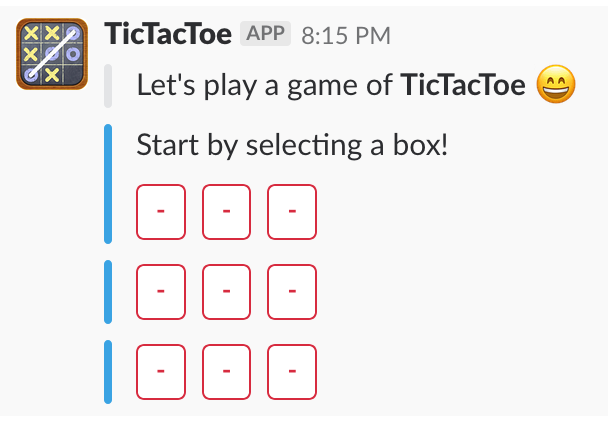
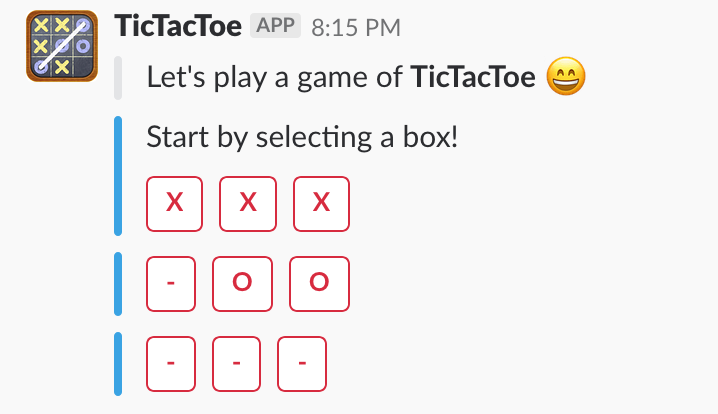
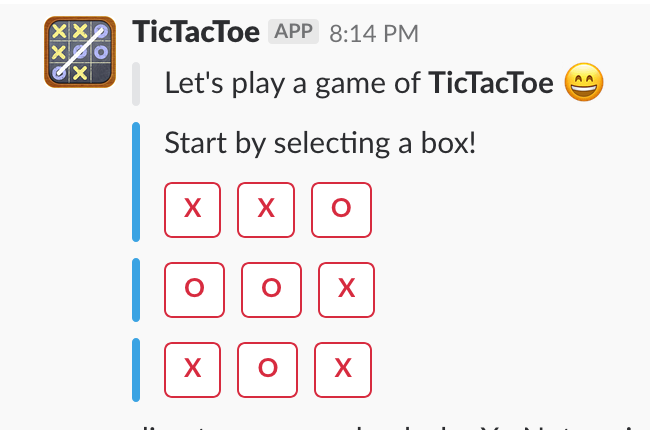

# TicTacToe Game App for Slackers #

A Simple Node Express Server listening on the events from Slack and running the 2-player TickTacToe game

<b>Integration Reference Material:</b>  
Intro to Slack using Node: https://api.slack.com/tutorials/intro-to-message-buttons  
Setup Oauth App in Slack: https://api.slack.com/tutorials/app-creation-and-oauth  
How to build TickTacToe - Algo: https://medium.com/@ojusmilindsave/tutorial-to-implement-tic-tac-toe-in-java-ad639661a9b 

<b>Instructions:</b> 
    - Invite a user to play in the slack channel by command (/ttt start )

* Prerequisites:
    - Node running local with tunnel (ngrok) OR Cloud runtime (AWS/Heroku/GCloud)
    - Slack Account with Channel/Workspace
    - 2-players (Play with Slackbot OR Self :)

* TODO: 
    - Test Cases updates
    - Test coverage report
    - Instruction Documentation for Play

<b>Intial Screen:</b>  

<b>Winner Screen:</b>  

<b>Draw Screen:</b>  

